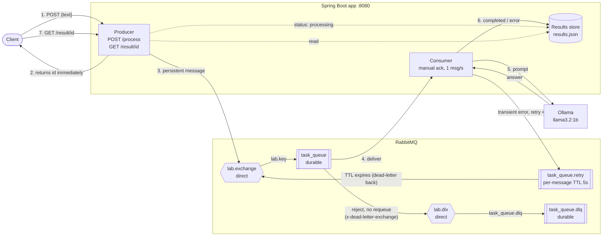

# AMQP AI Pipeline

COMP41720 Lab 1: Asynchronous Messaging with AI Tool Integration.

A Spring Boot service with a producer that accepts requests over HTTP and puts them on a RabbitMQ queue. A consumer takes them off the queue and processes each one by calling a local LLM through [Ollama](https://ollama.com) (`llama3.2:1b`), which is the lab brief's option A: free, with no API key and no account. Failed calls are retried through a delay queue. Messages that keep failing end up in a dead-letter queue (DLQ) instead of looping forever.

## Architecture



1. The client sends `POST /process {"text": "..."}`.
2. The producer saves the job as `processing` and returns `{"id": 1, "status": "processing"}` straight away, without waiting for the AI.
3. The producer publishes a **persistent** message to `lab.exchange`, which routes it to the **durable** `task_queue`:
   `{"id": 1, "text": "...", "timestamp": "2026-10-05T12:00:00Z"}`.
4. The consumer receives the message. It uses **manual acknowledgement**, so the message is only removed from the queue after processing finishes.
5. The consumer sends the text to Ollama (`POST /api/chat`).
6. The outcome depends on the result:
   - **Success:** the result is stored as `completed` and the message is acked.
   - **Transient failure** (Ollama down or unreachable, timeout, 5xx, 429) with retries left: a copy goes to `task_queue.retry` and the original is acked. The copy waits 5 s, then its TTL expires and RabbitMQ routes it back to `task_queue` for another attempt.
   - **Permanent failure** (e.g. 400, 404 model not pulled, invalid JSON) or **3 retries used up**: the result is stored as `error` and the message is **rejected without requeue**. The broker dead-letters it through `lab.dlx` to `task_queue.dlq`.
7. The client polls `GET /result/{id}`.

## Running

Prerequisites: Java 21+, Docker, and [Ollama](https://ollama.com).

```bash
brew install ollama && brew services start ollama   # Ollama on http://localhost:11434
ollama pull llama3.2:1b                             # ~1.3 GB, once
docker compose up -d                  # RabbitMQ on 5672, management UI on http://localhost:15672 (guest/guest)
./mvnw spring-boot:run                # app on http://localhost:8080
```

```bash
curl -X POST localhost:8080/process -H 'Content-Type: application/json' -d '{"text": "Explain AMQP in one sentence"}'
# 202 {"id":1,"status":"processing"}

curl localhost:8080/result/1
# 200 {"id":1,"status":"completed","text":"Explain AMQP in one sentence","result":"...","error":null,"attempts":1}
```

## API

| Method | Path | Body | Response |
|---|---|---|---|
| `POST` | `/process` | `{"text": "..."}` | `202` `{"id": 1, "status": "processing"}`. `400` if `text` is missing or blank. |
| `GET` | `/result/{id}` | none | `200` with `status` = `processing`, `completed` or `error`, plus `result` (the AI answer), `error` (the last failure) and `attempts`. `404` for an unknown id. |

## Project structure

| File | Role |
|---|---|
| `MessageProducer.java` | REST endpoints. Publishes each job as a persistent JSON message |
| `MessageConsumer.java` | Queue listener: rate limit, manual ack, retries, dead-lettering |
| `OllamaService.java` | Calls Ollama's `/api/chat` over HTTP. Decides which errors are transient |
| `RabbitConfig.java` | Declares the exchanges, queues and bindings (main, retry, DLQ) |
| `JobStore.java` | Results by request id, in memory and mirrored to `results.json` |
| `AiJob.java` | The queue message: `id`, `text`, `timestamp` |

## Dead-letter queue configuration (Task B)

Everything is declared in `RabbitConfig.java`:

| Object | Type | Settings |
|---|---|---|
| `lab.exchange` | direct exchange | durable |
| `task_queue` | queue | durable. `x-dead-letter-exchange=lab.dlx`, `x-dead-letter-routing-key=task_queue.dlq` |
| `task_queue.retry` | queue (no consumer) | durable. `x-dead-letter-exchange=lab.exchange`, `x-dead-letter-routing-key=lab.key`. Each message carries a per-message TTL (`expiration`) of `consumer.retry-delay-ms` (5000 ms) |
| `lab.dlx` | direct exchange | durable |
| `task_queue.dlq` | queue | durable, no TTL: failed messages stay until someone inspects or replays them |

| Binding | Routing key |
|---|---|
| `lab.exchange` → `task_queue` | `lab.key` |
| `lab.dlx` → `task_queue.dlq` | `task_queue.dlq` |

**Retry counting.** Each retry adds an `x-retry-count` header. Once a message has been retried `consumer.max-retries` (3) times and fails again, the consumer calls `basicReject(requeue=false)`. RabbitMQ then dead-letters it and adds an `x-death` header recording where it came from and why (`reason: rejected, queue: task_queue`).

**Why the retry goes through a separate queue instead of `basicNack(requeue=true)`.** Requeueing puts the message straight back at the head of the queue. The consumer then hits the failing API again immediately, with no delay and no count, which is exactly the infinite loop the lab warns about. The TTL queue adds a back-off, which suits rate limits, and the header gives a hard limit on retries.

### Testing the DLQ

Point the AI endpoint at a dead port (or stop Ollama with `brew services stop ollama`):

```bash
AI_BASE_URL=http://localhost:9 ./mvnw spring-boot:run   # dead port
curl -X POST localhost:8080/process -H 'Content-Type: application/json' -d '{"text": "poison"}'
```

The consumer logs attempts 1/4 to 4/4, 5 s apart, then `sending to DLQ`. In the management UI (Queues tab), `task_queue.retry` holds the message between attempts, and then `task_queue.dlq` goes to 1. `GET /result/{id}` returns `"status":"error"`.

Two other paths into the DLQ:
- **A permanent error** (e.g. a model that isn't pulled → 404) goes to the DLQ immediately, because retrying can't fix it.
- **A malformed message** also goes there immediately. In the management UI, publish `not json` to `lab.exchange` with routing key `lab.key`. The consumer can't parse it and rejects it into the DLQ, instead of looping on it.

### Why DLQs matter in production

A message that can never succeed, known as a *poison message*, will otherwise do one of two things. With requeue, it loops forever: it blocks the queue, burns CPU and API quota, and floods the logs. Without requeue, it is silently dropped, and the request is lost with no trace.

A DLQ is a third option. The message leaves the main queue, so healthy traffic keeps flowing, but it is kept with its failure reason (`x-death`) so someone can inspect it, alert on it, fix the cause and replay it.

This matters most when a consumer depends on an external service it doesn't control, like an AI API with rate limits, outages and unpredictable latency. It also matters for bad input from upstream (a schema change or corrupt data), and for anything where losing a request is unacceptable (payments, orders, audit events). The DLQ's depth is also a useful metric: if it rises, something is broken.

## Reliability experiments (Exercise 1.3)

### Manual acknowledgement vs. auto-ack

```bash
CONSUMER_CRASH_MID_PROCESSING=true ./mvnw spring-boot:run   # submit a job, the app halts before acking
./mvnw spring-boot:run                                      # restart normally
```

| Mode | After the crash | After the restart |
|---|---|---|
| `manual` (default) | The message is back in `task_queue` | Processed again, logged with `redelivered=true`, then acked. `GET /result/{id}` shows `completed` |
| `none` (auto-ack) | `task_queue` is empty | Nothing to process: the message was lost |

To try auto-ack, add `SPRING_RABBITMQ_LISTENER_SIMPLE_ACKNOWLEDGE_MODE=none` to both runs. This is at-least-once delivery: acking only after processing means a crash can cause a message to be processed twice, but never lost.

### Persistence across a broker restart

1. Publish a few jobs with the consumer switched off: `SPRING_RABBITMQ_LISTENER_SIMPLE_AUTO_STARTUP=false ./mvnw spring-boot:run`
2. Stop the app, then restart RabbitMQ: `docker restart rabbitmq` (or `docker compose restart`).
3. Check `docker exec rabbitmq rabbitmqctl list_queues name messages`. The messages survived.

If you publish with `PRODUCER_PERSISTENT_MESSAGES=false` instead, those messages are gone after the restart. `compose.yaml` gives RabbitMQ a fixed hostname and a data volume, so data also survives `docker compose down` / `up`. Only `down -v` deletes it.

### Rate-controlled consumption

At most 1 message per second starts (`consumer.messages-per-second`). Each one is logged:

```
Processing message id=3 text="Request 3" processingTimestamp=2026-09-28T11:54:10.967Z redelivered=false attempt=1/4 (queued at 2026-09-28T11:54:08Z, waited 2967 ms)
```

Submit a batch and watch the queue depth drop:

```bash
for i in $(seq 1 20); do curl -s -X POST localhost:8080/process -H 'Content-Type: application/json' -d "{\"text\":\"Request $i\"}"; done
docker exec rabbitmq rabbitmqctl list_queues name messages_ready messages_unacknowledged
```

## Configuration

Set in `src/main/resources/application.properties`. Any property can be overridden with an environment variable, e.g. `consumer.max-retries` → `CONSUMER_MAX_RETRIES`.

| Property | Default | Meaning |
|---|---|---|
| `ai.base-url` | `http://localhost:11434` | Ollama endpoint. Point it at a dead port to test the DLQ |
| `ai.model` | `llama3.2:1b` | Ollama model (must be pulled first) |
| `ai.timeout-seconds` | `120` | Read timeout per AI call. A timeout counts as a transient failure |
| `consumer.max-retries` | `3` | Retries after the first attempt before dead-lettering |
| `consumer.retry-delay-ms` | `5000` | Delay before each retry (per-message TTL in `task_queue.retry`) |
| `consumer.messages-per-second` | `1` | Rate limit across all consumer threads (`0` = unlimited) |
| `consumer.crash-mid-processing` | `false` | Lab switch: halt the app mid-processing, before the ack |
| `producer.persistent-messages` | `true` | Publish with delivery mode 2 (persistent) |
| `spring.rabbitmq.listener.simple.acknowledge-mode` | `manual` | `manual`: ack after processing. `none`: RabbitMQ auto-ack |
| `spring.rabbitmq.listener.simple.concurrency` / `max-concurrency` | `4` / `4` | Consumer threads |
| `spring.rabbitmq.listener.simple.prefetch` | `1` | Unacked messages per consumer thread |
| `results.file` | `results.json` | Where results are saved |

## Design notes and limitations

- **Retries happen in the queue, not the HTTP client.** The client makes one attempt per delivery, so every failed attempt shows up in RabbitMQ and counts towards the limit.
- **The first request after Ollama starts is slower** (a few seconds) while it loads the model into memory.
- **Order isn't guaranteed.** Four threads work in parallel, and retried messages rejoin the back of the queue. Use one thread for strict FIFO (first in, first out).
- **The results store is a local JSON file.** That's enough for one instance. Several app instances would need a shared store such as Redis or a database.
- **If the queue settings change**, delete the old queue first (e.g. in the management UI). RabbitMQ refuses to redeclare an existing queue with different arguments.

## Documentation

- [ADR 0001: RabbitMQ over Kafka](docs/adr/0001-rabbitmq-over-kafka.md)

## Tests

Start RabbitMQ first (`docker compose up -d`), then run `./mvnw test`.
